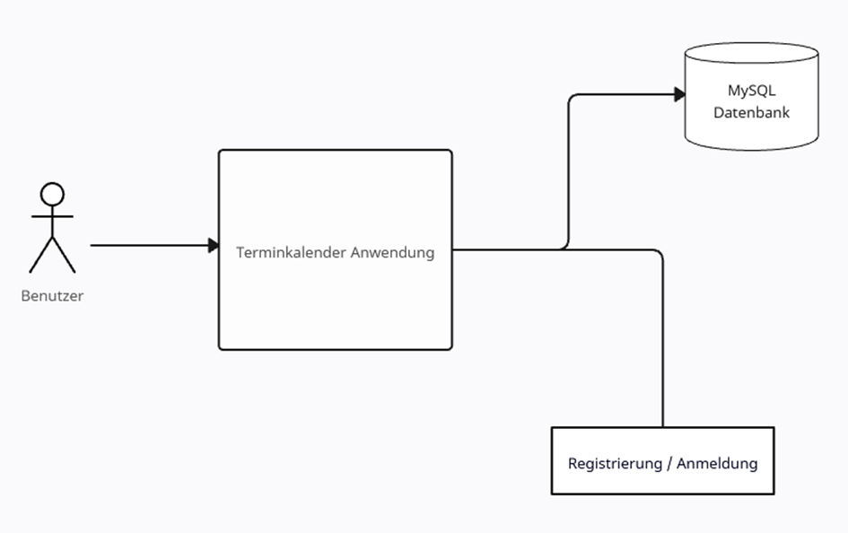
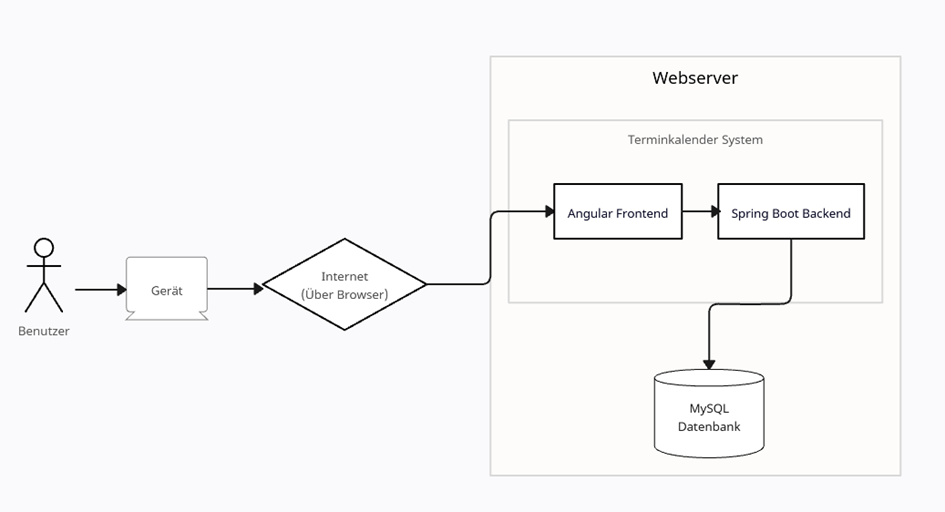
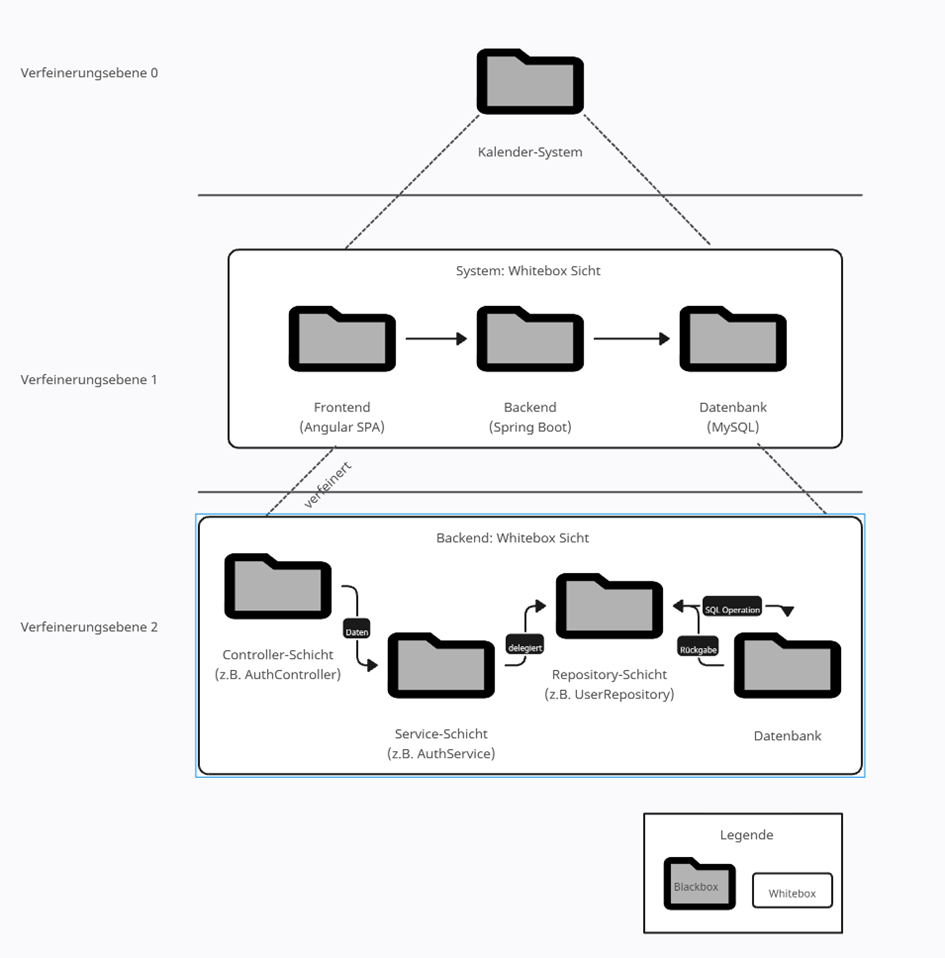

1.	Einleitung
Dieses Architekturdokument beschreibt die grundlegende Struktur und die wichtigsten Entwurfsentscheidungen der Terminkalender-Anwendung. Ziel ist es, allen Projektbeteiligten insbesondere Entwicklern, Betreibern und Entscheidern einen umfassenden Überblick über die Architektur, die Komponenten und deren Zusammenspiel zu geben.
Das Dokument richtet sich an Softwareentwickler, Systemarchitekten, Administratoren und alle, die an der Weiterentwicklung, dem Betrieb oder der Wartung des Systems beteiligt sind. Es erläutert die fachlichen und technischen Grundlagen, die den Aufbau und das Verhalten der Anwendung bestimmen.
Der Aufbau des Dokuments folgt bewährten Architekturstandards und gliedert sich in verschiedene Sichten: Nach einer Einleitung werden kurz die Außensicht, die Komponentensicht, die Betreibersicht, die Erstellungssicht, die physische Sicht und die Laufzeitsicht ausführlich behandelt. Tabellen und Diagramme unterstützen das Verständnis der Zusammenhänge. Die verwendeten Notationen orientieren sich an etablierten Standards wie UML und den Empfehlungen für Softwarearchitekturdokumentation.
Die Terminkalender-Anwendung ist ein webbasiertes System zur Verwaltung von Terminen, Benutzern und Kalenderansichten. Sie ist modular aufgebaut, skalierbar und für den Einsatz in unterschiedlichen Umgebungen konzipiert. Die Architektur legt besonderen Wert auf Wartbarkeit, Erweiterbarkeit und Sicherheit.

Qualitätsziele
Priorität	Qualitätsziel	Beschreibung	Metriken/Indikatoren
1	Sicherheit	Schutz von Termindaten und Benutzerkonten	JWT-Integrität, OWASP Top 10 Checks
2	Wartbarkeit	Saubere Schichtung & geringe Kopplung	SonarQube Issues, Zyklomatische Komplexität
3	Erweiterbarkeit	Neue Termin-Funktionen ohne Architekturbruch	LOC pro Feature, Anzahl modifizierter Module
4	Performance	Antwortzeit < 2s (95% P95)	API-Metriken, Actuator Traces
5	Testbarkeit	Hohe Abdeckung kritischer Logik	Line/Branch Coverage, Mutation Score

Stakeholder
Rolle	Interesse	Relevante Aspekte
Endbenutzer	Termine verwalten	Usability, Performance
Administrator	Betrieb, Monitoring	Logs, Health, Backups
Entwicklerteam	Weiterentwicklung	Codequalität, Tests

Randbedingungen
Technische Randbedingungen
Aspekt	Details
Programmiersprache	Java 17 (LTS) – Nutzung moderner Sprachfeatures ohne Abhängigkeit auf preview
Framework	Spring Boot (Spring Web, Spring Security, Spring Data JPA) – vereinfacht Inversion of Control, Security-Konfiguration und Persistenz
Datenbanken	H2 (Entwicklung, Datei-/Memory-Mode via application.yml), MySQL für fertige Anwendung 
Build-Tool	Maven (pom.xml) – Standard-Plugins, Erweiterbar mit Flyway, JaCoCo
Deployment	Lokaler Start via mvn spring-boot:run, Containerisierung vorbereitet (Dockerfile im Root-Verzeichnis)
Security-Secret	JWT-Secret aktuell hardcodiert in AuthService – muss produktiv externalisiert werden (ENV / Vault)

2.	Außensicht
Die Außensicht beschreibt das System aus der Perspektive der Nutzer und der Nachbarsysteme. Im Zentrum steht der Geschäftsprozess der Terminverwaltung, der die Erstellung, Bearbeitung, Verschiebung, Löschung und Suche von Terminen umfasst. Diese Prozesse sind in der Spezifikation in Kap. 2.1 ausführlich beschrieben und bilden die Grundlage für die Systementwicklung. Das Datenmodell besteht aus den Entitäten Benutzer, Termin und Kategorie, ergänzt durch die Enumeration Priorität. Auch diese Struktur ist bereits in der Spezifikation (Kap. 3) dokumentiert und wird dort anhand eines UML-Klassendiagramms illustriert.
Die Funktionen des Systems sind in Form von Use Cases (UC1–UC9) festgelegt und umfassen unter anderem die Registrierung und Anmeldung von Benutzern, die Verwaltung von Terminen sowie die Verwaltung von Kategorien. Diese Use Cases sind in Kap. 2.5 der Spezifikation aufgeführt und durch Use-Case-Diagramme visualisiert. Die Benutzeroberfläche, einschließlich der Dialoglandkarte, Mockups und Navigationsmöglichkeiten, ist ebenfalls Bestandteil der Spezifikation (Kap. 4). Nachbarsysteme spielen nur eine untergeordnete Rolle: Hauptsächlich handelt es sich um optionale E-Mail-Dienste, die für Funktionen wie den Passwort-Reset genutzt werden können (Spezifikation Kap. 5).
2.1	Batch-Benutzerschnittstellen
Für das System sind derzeit keine Batch-Benutzerschnittstellen vorgesehen. Alle Interaktionen erfolgen über die Weboberfläche oder automatisiert über Rest-APIs. Typische Batch-Funktionen wie periodische Import-/ Export-Jobs, Massenverarbeitung oder nächtliche Batch-Läufe sind im aktuellen Projektkontext nicht vorgesehen und daher nicht Bestandteil der Architektur.
2.2	Nachbarsysteme
Nachbarsysteme spielen in der aktuellen Ausbaustufe nur eine untergeordnete Rolle. Optional ist ein externer E‑Mail‑Dienst für den Passwort‑Reset vorgesehen. Weitere Integrationen (z. B. Push‑Benachrichtigungen) sind bewusst nicht Teil dieser Ausarbeitung und werden in der Spezifikation lediglich als Perspektive erwähnt.

2.3	Randbedingungen
Die technischen und organisatorischen Rahmenbedingungen stecken den Handlungsraum für Entwurf und Umsetzung ab. Technisch wird die Anwendung mit Angular im Frontend und Spring Boot im Backend umgesetzt. Die Datenhaltung erfolgt relational in MySQL. Die Kommunikation zwischen Browser und backend ist auf HTTPS beschränkt. Das Backend stellt ausschließlich REST‑Endpunkte bereit und bleibt zustandslos (JWT). Der Betrieb erfolgt containerisiert mit Docker. Konfigurationen werden per Umgebungsvariablen injiziert. Organisatorisch wird in einem kleinen Team gearbeitet; Quellcodeverwaltung laufen auf einer zentralen Git‑Plattform. Die Hauptsächliche Kommunikation untereinander und die Verwaltung der Dokumentationen lief über einen Discord Server, Welcher zu Beginn des Projekts erstellt wurde. Des Weiteren wurde sich über WhatsApp abgestimmt.
3.	Innensicht
Die Innensicht beschreibt die technische Gliederung und Umsetzung des Systems. Die Anwendung folgt einer klassischen Drei-Schichten-Architektur. In der Präsentationsschicht wird eine Angular Single Page Application eingesetzt. Sie bildet die Schnittstelle zum Benutzer, verarbeitet dessen Eingaben und kommuniziert ausschließlich über eine REST-Schnittstelle mit dem Backend. Das Backend basiert auf Spring Boot und enthält Controller, die HTTP-Anfragen entgegennehmen, Services, welche die Geschäftslogik kapseln, sowie Sicherheits- und Fehlerbehandlungskomponenten. Für die Datenhaltung kommt Spring Data JPA in Kombination mit einer MySQL-Datenbank zum Einsatz.
Der Betrieb der Anwendung erfolgt containerisiert. Sowohl das Backend als auch die Datenbank werden in Docker-Containern betrieben. Der Start und Stopp der Anwendung erfolgt über Docker Compose.
Die Erstellungssicht beschreibt die technische Basis der Entwicklung. Das Backend wird in Java mit Spring Boot entwickelt und mit Maven gebaut. Das Frontend basiert auf TypeScript und Angular und wird mit npm kompiliert. So wird eine gleichbleibende Qualität der Software sichergestellt.
In der physischen Sicht zeigt sich das System als eine Zusammensetzung aus einem Webbrowser, der als Client dient, einem Spring Boot Backend, das in einem Container ausgeführt wird, und einer MySQL-Datenbank, die in einem separaten Container betrieben wird. Diese einfache, aber robuste Systemlandschaft kann bei Bedarf durch einen Load Balancer oder durch Container-Orchestrierung mit Kubernetes ergänzt werden, um Skalierbarkeit und Ausfallsicherheit zu erhöhen.
Die Laufzeitsicht lässt sich am besten anhand von Sequenzdiagrammen erläutern. In der Spezifikation sind exemplarisch die Use Cases Anmeldung (UC2), Termin-Erstellung (UC3) und Passwort zurücksetzen (UC7) dokumentiert. Sie verdeutlichen, wie Benutzeraktionen durch das Frontend an das Backend übermittelt werden, dort validiert und weiterverarbeitet werden und schließlich in der Persistenzschicht gespeichert oder verändert werden. Erfolgs- und Fehlerpfade werden ebenfalls berücksichtigt, sodass der Ablauf für die Entwickler und Architekten nachvollziehbar bleibt.
3.1	Komponentensicht
3.1.1	Kontextabgrenzung
3.1.1.1	Fachlicher Kontext

Abbildung 1 Fachlicher Kontext
Fachlich betrachtet interagieren Benutzer über den Web‑Browser mit einer Kalenderoberfläche, um Termine anzulegen, zu ändern, zu verschieben, zu suchen und zu löschen. Persistente Daten, Benutzer, Termine und Kategorien werden im Backend validiert und in der Datenbank gespeichert. Technisch betrachtet ist der Browser der einzige externe Client. Er kommuniziert über HTTPS mit dem Spring‑Boot‑Dienst. Das Backend kapselt sämtliche Zugriffe auf MySQL. Direkte Datenbankverbindungen von außen sind ausgeschlossen. Die Grenze des Systems verläuft damit entlang der REST‑Schnittstelle des Backends: alles dahinter (Geschäftslogik, Persistenz, Security) ist Teil des Systems, alles davor (Client‑Geräte, Netzwerkinfrastruktur) gehört zum Umfeld.

3.1.1.2	Technischer Kontext

Abbildung 2 Technischer Kontext
Das technische Kontextdiagramm zeigt die Einbettung des Terminkalenders in seine Umgebung. Der Nutzer greift über ein Endgerät mit einem Webbrowser auf das System zu. Die Kommunikation erfolgt dabei über das Internet mittels HTTPS.
Innerhalb des Systems ist das Angular-Frontend für die Darstellung der Benutzeroberfläche und die Interaktion mit dem Anwender verantwortlich. Es verarbeitet Benutzereingaben, führt erste Validierungen durch und kommuniziert ausschließlich über REST-Schnittstellen mit dem Backend.
Das Spring-Boot-Backend stellt die Geschäftslogik, die Authentifizierungs- und Autorisierungsmechanismen sowie die Schnittstellen für die Termin- und Benutzerverwaltung bereit. Es ist zudem für die zentrale Fehlerbehandlung und die Sicherheit (z. B. JWT-Token, Rollenprüfung, Passwort-Hashing) zuständig.
Alle Daten wie Benutzerdaten, Termine und Kategorien werden in einer relationalen MySQL-Datenbank persistiert. Das Backend greift über JPA/Hibernate auf die Datenbank zu.
Durch diese klare Trennung in Browser-Frontend, Backend-Services und Datenbank entsteht eine übersichtliche Systemarchitektur, die sich leicht erweitern, warten und skalieren lässt.

3.1.1.3	Lösungsstrategie
Die Lösungsstrategie folgt der Trennung der Zuständigkeiten. Die Angular‑SPA übernimmt die Darstellung und Interaktion, das Spring‑Boot‑Backend bündelt Geschäftslogik und Sicherheitsmechanismen und die relationale Datenbank gewährleistet Konsistenz und Transaktionen. Sicherheit wird durch ein stateless Authentifizierungsverfahren mit JWT und rollenbasierter Autorisierung umgesetzt; Passwörter werden mit BCrypt gehasht. Datenqualität wird serverseitig über DTO‑Validierungen und Geschäftsregeln (z. B. „Endzeit muss nach Startzeit liegen“) sichergestellt. Die Benutzeroberfläche ist bewusst reduziert gestaltet. Häufige Aktionen (Termin erstellen/ändern) sind ohne Kontextwechsel erreichbar, Such‑ und Filterfunktionen sind in der Kalenderansicht integriert. Die Strategie begünstigt horizontale Skalierung und reduziert Kopplung zwischen Client und Server.

3.1.2	Bausteinsicht

Abbildung 3 Bausteinsicht
3.1.2.1	Verfeinerungsebene 0
Auf der obersten Ebene wird das Gesamtsystem als Terminkalender-System betrachtet. Es umfasst alle Komponenten, die zur Bereitstellung der Anwendung notwendig sind: die Benutzerschnittstelle im Browser, die fachliche Logik im Backend sowie die persistente Speicherung in der Datenbank.
3.1.2.2	Verfeinerungsebene 1
In der nächsten Verfeinerungsebene zeigt sich eine klare Aufteilung in drei Hauptbausteine. Das Frontend, das als Angular Single-Page-Application realisiert ist, stellt die Präsentationsschicht dar. Es dient der Interaktion mit dem Benutzer, übernimmt die Validierung von Eingaben und kommuniziert ausschließlich über REST-Schnittstellen mit dem Backend. Das Backend basiert auf Spring Boot und implementiert die fachliche Logik der Anwendung. Es kümmert sich um Authentifizierung und Autorisierung, verwaltet Benutzerkonten und Termine, verarbeitet Suchanfragen und regelt den Zugriff auf die Datenbank. Die MySQL-Datenbank dient der dauerhaften Speicherung sämtlicher Informationen wie Benutzer, Termine, Kategorien und Prioritäten.
3.1.2.3	Verfeinerungsebene 2
Das Backend wird in einer weiteren Ebene detailliert betrachtet. Auf der Controller-Schicht werden die Anfragen des Frontends entgegengenommen. Hier befinden sich beispielsweise der AuthController für Registrierung und Login, der AppointmentController für die Verwaltung von Terminen sowie der CategoryController für die Organisation von Kategorien. Die Controller prüfen Anfragen und leiten sie an die entsprechende Serviceschicht weiter.
Die Service-Schicht enthält die eigentliche Geschäftslogik. Hier werden Regeln wie die Kollisionsprüfung bei Terminen, die Zuweisung von Kategorien oder die Verwaltung von Benutzerinformationen umgesetzt. Beispiele für diese Schicht sind der AuthService, der AppointmentService oder der CategoryService.
Für den Zugriff auf die Datenhaltung sorgt die Repository-Schicht, die mittels Spring Data JPA die Verbindung zur MySQL-Datenbank herstellt. Typische Bausteine sind das UserRepository, das AppointmentRepository und das CategoryRepository. Sie kapseln die Datenzugriffe und stellen der Serviceschicht eine klare Schnittstelle bereit.
Die MySQL-Datenbank bildet die Grundlage für die dauerhafte Speicherung. Sie hält alle relevanten Datenbestände wie Benutzerinformationen, Termindaten und Kategorien vor und gewährleistet deren konsistente Verwaltung.
Durch diese hierarchische Struktur – vom Gesamtsystem über die Hauptbausteine bis hin zur detaillierten Whitebox-Sicht des Backends – wird eine klare Trennung der Verantwortlichkeiten erreicht. Dies erleichtert nicht nur die Verständlichkeit der Architektur, sondern sorgt auch für Wartbarkeit, Erweiterbarkeit und eine saubere Umsetzung der definierten Qualitätsziele.
3.2	Betreibersicht
Die Betreibersicht beschreibt alle Aspekte rund um Installation, Betrieb, Wartung, Notfallmaßnahmen und Kompatibilität der Terminkalender-Anwendung. Sie richtet sich an Administratoren, Betreiber und Support-Teams und stellt sicher, dass das System zuverlässig, sicher und effizient betrieben werden kann.
3.2.1	Übersicht der wichtigsten Betriebsaufgaben
Aufgabe	Beschreibung	Verantwortlich
Installation	JAR bauen, DB anlegen, Konfiguration, Start	Administrator
Deinstallation	Anwendung stoppen, Dateien & DB entfernen	Administrator

Backup	Täglicher Dump, Sicherung der Konfiguration	Admin/Operator
Restore	Backup einspielen, Anwendung neu starten	Admin/Operator
Monitoring	Systemressourcen & Health-Checks überwachen	Operator

Update	Neue Version bauen, einspielen, testen	Administrator
Notfallmaßnahmen
	Neustart, Fehleranalyse 	Operator
Tabelle 1 Betriebsaufgaben
3.2.2	Systemvoraussetzungen und Installation
Für den Betrieb der Anwendung werden Java 17 oder höher, Maven ab Version 3.9 und eine MySQL-Datenbank benötigt. Unterstützt werden Windows, Linux und MacOS. Optional können Docker, Nginx als Reverse Proxy und ein SMTP-Server für E-Mail-Benachrichtigungen eingesetzt werden.
Die Installation erfolgt in mehreren Schritten: Nach dem Klonen des Quellcodes oder dem Bezug eines Release-Pakets wird das Projekt mit Maven gebaut, wodurch ein ausführbares JAR-File entsteht. Die Konfiguration der Datenbank erfolgt über die Datei application-prod.properties oder application.yml. Die Anwendung kann dann entweder direkt als JAR mit dem Befehl `java -jar ...` oder – insbesondere während der Entwicklung – mit `mvn spring-boot:run` gestartet werden. Alternativ ist auch ein Betrieb in Docker-Containern möglich. Für den Produktivbetrieb empfiehlt sich die Nutzung eines Reverse Proxys wie Nginx und die Integration in Systemdienste für einen automatischen Neustart nach Systemausfällen.
3.2.3	Betrieb und Systemstart
Das Starten und Anhalten des Systems ist sowohl für Entwicklung als auch Produktion klar geregelt. Während der Entwicklung wird meist `mvn spring-boot:run` verwendet, was schnelles Testen und Hot-Reload ermöglicht. Im Produktivbetrieb wird das gebaute JAR mit `java -jar ...` gestartet, was Stabilität und Portabilität gewährleistet. Das Anhalten erfolgt durch das Beenden des Prozesses im Terminal, per Systemdienst oder – bei Containern – mit `docker-compose down`.
3.2.4	Mehrfachinstallation und Koexistenz
Die Anwendung kann mehrfach auf einem Rechner installiert und betrieben werden, sofern unterschiedliche Ports und Datenbanknamen verwendet werden. Dies ermöglicht den parallelen Betrieb mehrerer, unterschiedlich parametrierter Instanzen, etwa für Test- und Produktivumgebungen. Auch der parallele Betrieb mit anderen Java-Anwendungen oder Webservern ist problemlos möglich, solange Port-Konflikte vermieden werden. MySQL kann gemeinsam mit anderen Anwendungen genutzt werden, sofern unterschiedliche Datenbanken verwendet werden. Bei parallelem Betrieb mit anderen Webservern (z.B. Apache, Tomcat) ist auf unterschiedliche Ports und ggf. eine Reverse Proxy-Konfiguration zu achten.
3.2.5	Betriebsressource
Für den stabilen Betrieb sind ausreichend Festplattenspeicher für Datenbank, Backups und Logdateien sowie genügend Arbeitsspeicher und CPU-Ressourcen erforderlich. Für E-Mail-Benachrichtigungen wird ein SMTP-Server benötigt.
3.2.6	Backup, Recovery und Notfallmaßnahmen
Regelmäßige Backups der MySQL-Datenbank werden empfohlen, etwa durch tägliche Dumps mit `mysqldump`. Auch die Konfigurationsdateien sollten regelmäßig gesichert werden. Im Notfall kann das letzte Backup mit `mysql` oder einem Datenbank-Tool wieder eingespielt werden. Die Integrität der Backups wird regelmäßig überprüft und Test-Restores werden durchgeführt, um die Wiederherstellbarkeit sicherzustellen.
Im Falle von Zwischenfällen sind verschiedene Maßnahmen vorgesehen: Fällt ein App-Server aus, übernimmt der Load Balancer das Routing auf verbleibende Instanzen. Bei Ausfall der Datenbank empfiehlt sich ein Failover-Cluster oder ein Backup-Server. Redundante Netzwerkverbindungen und Monitoring sorgen für zusätzliche Ausfallsicherheit. Bei Ausfall einzelner Software-Komponenten werden diese gezielt neu gestartet, wobei Logs und Monitoring-Daten zur Fehleranalyse herangezogen werden.
3.2.7	Monitoring und Updates
Das Monitoring der Anwendung erfolgt über Spring Boot Actuator, der Health Checks und Metriken bereitstellt. Systemressourcen wie CPU, RAM und Festplatte werden überwacht, und bei Grenzwertüberschreitungen werden Alarme ausgelöst. Das Logging erfolgt zentral mit Logback, wobei alle Anfragen, Fehler und Systemereignisse protokolliert und bei Bedarf an zentrale Systeme wie den ELK-Stack weitergeleitet werden. Regelmäßige Updates der Abhängigkeiten, die Überwachung auf Sicherheitslücken (z.B. mit Dependabot) und eine konsequente Zugriffskontrolle sorgen für einen sicheren Betrieb.
3.3	Erstellungssicht
Die Erstellungssicht beschreibt die Struktur und Organisation der Softwareartefakte, aus denen das Laufzeitsystem der Terminkalender-Anwendung gebaut wird. Sie gibt einen Überblick über alle technischen Einheiten wie Quellcode, Bibliotheken, Skripte, Build-Files und ausführbare Programme. Zudem wird die Verteilung dieser Artefakte auf die Zielsysteme erläutert.
3.3.1	Programmquellen
Die Anwendung basiert auf Java und verwendet das Spring Boot Framework. Der gesamte Quellcode befindet sich im GitHub Repository und ist in verschiedene Pakete unterteilt:
•	controller: REST-API-Endpunkte
•	service: Geschäftslogik
•	repository: Datenzugriff (JPA)
•	entity: Datenmodelle
•	dto: Data Transfer Objects
•	config: Konfigurationen und Security
3.3.2	Statische und dynamische Bibliotheken
Die Anwendung nutzt zahlreiche externe Bibliotheken, die über Maven im `pom.xml` verwaltet werden. Dazu zählen u.a.:
•	Spring Boot Starter (Web, Data JPA, Security)
•	MySQL Connector
•	JWT (JSON Web Token)
•	Lombok
•	Logback
•	JUnit, Mockito (Test)
Diese Bibliotheken werden beim Build automatisch eingebunden und als Teil des ausführbaren JARs ausgeliefert. Sie definiert alle Abhängigkeiten, Plugins und Build-Prozesse. Der Build erzeugt ein ausführbares JAR im Verzeichnis `target/`.
3.4	Physische Sicht
3.4.1	Verteilung auf Zielsysteme
Die Softwareartefakte werden wie folgt verteilt:
- App-Server: Enthält das JAR-File, Konfigurationsdateien und ggf. Skripte
- Datenbank-Server: MySQL-Installation, ggf. Initialisierungsskripte
- Monitoring-Server: (Optional) Monitoring-Tools und Konfigurationen
Die Verteilung kann lokal, auf mehreren Servern oder in der Cloud erfolgen. Die Erstellungssicht stellt sicher, dass alle notwendigen Artefakte für einen erfolgreichen Build und Betrieb bereitgestellt werden.
3.4.2	Genutzte physische Geräte
Die physische Sicht beschreibt die reale Hardware- und Netzwerkstruktur, auf der die Terminkalender-Anwendung betrieben wird. Sie konzentriert sich auf die genutzten Geräte und deren Zusammenspiel, ohne dabei bereits in die Details der Softwareverteilung oder Prozesssteuerung zu gehen.
Das System nutzt folgende physische Ressourcen:
•	Server/Computer: Für die Ausführung der Anwendung (App-Server) und der Datenbank (MySQL-Server). Diese können als physische oder virtuelle Maschinen bereitgestellt werden und sind oft gemeinsam mit anderen Systemen im Einsatz (z.B. in einer Cloud- oder Virtualisierungsumgebung).
•	Netzwerkverbindungen: Ethernet, WLAN oder VPN zur Kommunikation zwischen App-Server, Datenbank und ggf. Monitoring-System. Die Leitungen werden gemeinsam mit anderen Systemen genutzt, sind aber für die Verfügbarkeit und Performance kritisch.
•	Bildschirme: Für Administratoren und Nutzer, die auf die Weboberfläche zugreifen. Die Anwendung selbst benötigt keine dedizierten Bildschirme auf dem Server.
•	Drucker: Werden nur benötigt, wenn Ausdrucke von Terminen oder Listen erfolgen sollen. Die Anwendung kann mit beliebigen, im Netzwerk verfügbaren Druckern zusammenarbeiten.
3.4.3	Ausführbare Programme
Das Hauptartefakt ist das JAR-File, z.B. `terminkalender-0.0.1-SNAPSHOT.jar`, das auf jedem Zielsystem mit Java 17+ ausgeführt werden kann. Für den Produktivbetrieb kann das JAR als Systemdienst oder in einem Docker-Container betrieben werden.
3.5	Laufzeitsicht
Zur Laufzeit zeigt sich das System als Abfolge klarer Schritte zwischen Browser, Backend und Datenbank. Wenn ein Benutzer sich anmeldet, sendet das Frontend die Anmeldedaten an einen REST-Endpunkt des Backends. Dort werden die Daten validiert und die Zugangsdaten gegen die gespeicherten Passwort-Hashes geprüft. Bei Erfolg erzeugt das Backend ein kurzlebiges JWT und gibt es an den Browser zurück. Anschließende Anfragen führen das Token im Authorization-Header mit; das Backend verifiziert das Token, ermittelt daraus Identität und Rollen und führt die gewünschte Operation aus.
Bei der Erstellung eines Termins löst der Nutzer die Aktion in der Kalenderoberfläche aus. Das Frontend überträgt die Termindaten als JSON. Der zuständige Controller validiert die Nutzlast, die Domänenschicht prüft Geschäftsregeln (u. a. die zeitliche Konsistenz) und schreibt den Datensatz über JPA in die relationale Datenbank. Die Antwort enthält den gespeicherten Termin; das Frontend aktualisiert daraufhin die Ansicht ohne Seiten-Reload. Fehlerfälle – z. B. ungültige Zeitintervalle oder fehlende Pflichtfelder – werden zentral abgefangen und als konsistente JSON-Fehlermeldungen zurückgegeben.
Der Passwort-Reset beginnt mit der Anforderung eines Reset-Links. Das Backend erzeugt ein Einmal-Token, persistiert dessen Gültigkeit und adressiert den Versand an den konfigurierten E-Mail-Dienst. Über den Link setzt der Benutzer ein neues Passwort, das nach Validierung gehasht in der Datenbank gespeichert wird. Timeouts, Wiederholungen bei transienten Fehlern und strukturierte Protokollierung sorgen dafür, dass die Abläufe robust bleiben und im Betrieb nachvollzogen werden können.
3.5.1	Beispielhafter Ablauf: Termin-Erstellung
 
Abbildung 4 Ablauf Terminerstellung
Das Zusammenspiel der Komponenten ist klar definiert: Der Web-Client sendet HTTP-Anfragen an die Controller des Backends. Diese validieren die Daten und delegieren die Geschäftslogik an die Service-Klassen. Die Services greifen über die Repositories auf die Datenbank zu. Sicherheits- und Fehlerbehandlungskomponenten sind als Querschnittsfunktionen integriert und sorgen für einen robusten und sicheren Ablauf. Beispielhaft sei die Termin-Erstellung genannt: Der Benutzer sendet eine Anfrage, der Controller prüft und leitet weiter, der Service prüft auf Kollisionen und speichert den Termin, die Antwort wird an den Client zurückgegeben. Ebenso läuft die Authentifizierung ab: Die Zugangsdaten werden geprüft, ein JWT-Token wird erstellt und für weitere Anfragen genutzt.
Die Architektur ist so gestaltet, dass sie leicht erweiterbar ist. Neue Komponenten wie Benachrichtigungsdienste, externe Kalenderintegration oder zusätzliche Entitäten können problemlos ergänzt werden. Die klare Trennung der Schichten und die Nutzung etablierter Frameworks sorgen für Wartbarkeit, Testbarkeit und Skalierbarkeit der Anwendung. Die Komponentensicht bildet damit das stabile Fundament für die gesamte Systemarchitektur.

4.3	Qualitätsmerkmale
Die Qualität der Terminkalender-Anwendung wird durch verschiedene Merkmale geprägt, die sowohl technische als auch nutzerorientierte Anforderungen abdecken. Im Folgenden werden die wichtigsten Qualitätsmerkmale ausführlich und im Fließtext beschrieben.
4.3.1	Leistungsfähigkeit
Die Anwendung ist darauf ausgelegt, auch bei hoher Nutzerzahl stets eine sehr gute Performance zu bieten. Kurze Antwortzeiten und eine flüssige Bedienung werden durch optimierte Datenbankabfragen, den gezielten Einsatz von Indizes und Caching-Mechanismen erreicht. Längere Aufgaben wie das Versenden von E-Mail-Benachrichtigungen werden asynchron verarbeitet, sodass die Nutzeroberfläche jederzeit reaktionsschnell bleibt. Die Last wird über mehrere App-Server verteilt, was eine flexible Skalierung ermöglicht. Die Systemauslastung und Antwortzeiten werden kontinuierlich mit modernen Monitoring-Lösungen wie Prometheus und Grafana überwacht, um Engpässe frühzeitig zu erkennen und zu beheben.
4.3.2	Benutzerfreundlichkeit
Im Zentrum der Entwicklung steht die Benutzerfreundlichkeit. Die Weboberfläche ist intuitiv, selbsterklärend und responsiv gestaltet, sodass sie auf verschiedenen Endgeräten wie Desktop, Tablet und Smartphone optimal nutzbar ist. Die Benutzerführung ist konsistent und verständlich, während die Gestaltung der Oberfläche sich an anerkannten Standards für Barrierefreiheit orientiert. Fehlermeldungen sind klar formuliert und helfen den Nutzern, Probleme eigenständig zu lösen. Ergänzend stehen Hilfetexte und eine verständliche Dokumentation zur Verfügung, um die Nutzung der Anwendung so einfach wie möglich zu machen.
4.3.3	Wartung und Erweiterbarkeit
Die Architektur der Anwendung ist so gestaltet, dass sie leicht gewartet und flexibel erweitert werden kann. Eine klare Trennung der Schichten – Präsentation, Geschäftslogik und Datenhaltung – sorgt für Übersichtlichkeit und erleichtert Anpassungen. Die Komponenten sind modular aufgebaut und lose gekoppelt, sodass neue Funktionen oder Änderungen mit minimalem Aufwand integriert werden können. Die Konfiguration erfolgt zentral und versioniert, was die Nachvollziehbarkeit von Änderungen sicherstellt. Eine ausführliche und aktuelle Dokumentation unterstützt die Wartung ebenso wie automatisierte Tests und statische Codeanalysen, die die Codequalität kontinuierlich sichern.
5.	Architekturentscheidungen
5.1	Einleitung
Bei der Wahl der Technologien wurden Stabilität und langfristige Wartbarkeit berücksichtigt. Für das Backend fiel die Wahl auf Java mit Spring Boot, da es ein stabiles Framework mit einem großen Ökosystem ist. Für das Frontend wurde Angular ausgewählt, da es eine klare Struktur und einheitliche Entwicklungsparadigmen bietet. Die Daten werden in einer relationalen MySQL-Datenbank gespeichert, die sowohl robust als auch weit verbreitet ist. Für die Authentifizierung wurde JWT gewählt, da dieses Verfahren einfach, stateless und leicht skalierbar ist. Die Schnittstellen sind als REST-Endpunkte realisiert, da sie leicht verständlich und mit einer Vielzahl von Clients kompatibel sind. Für das Deployment wird Docker eingesetzt, optional ergänzt durch Kubernetes, um eine flexible Skalierung zu ermöglichen.
5.2	Authentifizierung und Sicherheit
Die Anwendung setzt auf JWT (JSON Web Tokens) in Kombination mit Spring Security. Diese Entscheidung ermöglicht eine stateless Architektur, die sich leicht horizontal skalieren lässt. Jeder Request trägt die notwendigen Authentifizierungsinformationen selbst im Token, ohne dass der Server Session-Daten speichern muss.
 
5.2.1	Umsetzungsbeispiele (A&S)
5.2.1.1	Security-Konfiguration
Der Einstiegspunkt für die Sicherheitslogik ist eine Konfigurationsklasse. Hier wird festgelegt, welche Endpunkte frei erreichbar sind (z. B. /auth/login), und dass alle anderen Anfragen authentifiziert sein müssen.
5.2.1.2	Codebeispiel (Security-Konfiguration)
 
5.2.1.3	JWT-Generierung
Beim erfolgreichen Login wird ein signiertes JWT erstellt und an den Client zurückgegeben
5.2.1.4	Codebeispiel (JWT-Generierung)
5.2.1.5	Verwendung im Controller
Beispiel: Nur eingeloggte Benutzer mir der Rolle „Admin“ dürfen Termine löschen.
5.2.1.6	Codebeispiel (Verwendung im Controller)
5.3	Datenbanktechnologie
Für die Anwendung wurde MySQL als relationale Datenbank gewählt. Die Gründe dafür sind die hohe Verbreitung, Stabilität, gute Cloud-Unterstützung und die Erfahrungen im Entwicklerteam.
 
5.3.1	Umsetzungsbeispiele (DB-Technologie)
5.3.1.1	Konfiguration in application.yml
5.3.1.2	Entity Klasse
5.3.1.3	Repository

