# UML-Diagramme - Terminkalender-Anwendung

## 1. Use Case Diagramm

```plantuml
@startuml
!define RECTANGLE class

actor "Benutzer" as User
actor "System Administrator" as Admin

rectangle "Terminkalender System" {
  usecase "Termin erstellen" as UC1
  usecase "Termine anzeigen" as UC2
  usecase "Termin bearbeiten" as UC3
  usecase "Termin löschen" as UC4
  usecase "Termine suchen" as UC5
  usecase "Kalenderansicht" as UC6
  usecase "Termine filtern" as UC7
  
  usecase "System konfigurieren" as UC8
  usecase "Benutzer verwalten" as UC9
  usecase "Backup erstellen" as UC10
}

User --> UC1
User --> UC2
User --> UC3
User --> UC4
User --> UC5
User --> UC6
User --> UC7

Admin --> UC8
Admin --> UC9
Admin --> UC10

UC6 .> UC2 : <<include>>
UC5 .> UC2 : <<include>>
UC7 .> UC2 : <<include>>

note right of UC1
  Benutzer kann neue Termine
  mit Titel, Datum, Uhrzeit
  und Beschreibung erstellen
end note

note right of UC6
  Monats- und Wochenansicht
  mit visueller Darstellung
  der Termine
end note
@enduml
```

## 2. Klassen-Diagramm

## 3. Sequenz-Diagramm: Termin erstellen

## 4. Sequenz-Diagramm: Termine abrufen

## 5. Aktivitäts-Diagramm: Terminbearbeitung

## 6. Komponenten-Diagramm

## 7. Deployment-Diagramm

## 8. Zustandsdiagramm: Termin-Lifecycle

```plantuml
@startuml
[*] --> Draft : Termin wird erstellt

Draft --> Scheduled : Termin wird gespeichert
Draft --> [*] : Erstellung abgebrochen

Scheduled --> InProgress : Startzeitpunkt erreicht
Scheduled --> Modified : Termin wird bearbeitet
Scheduled --> Cancelled : Termin wird abgesagt

Modified --> Scheduled : Änderungen gespeichert
Modified --> [*] : Änderungen verworfen

InProgress --> Completed : Endzeitpunkt erreicht
InProgress --> Cancelled : Termin wird abgebrochen

Cancelled --> [*] : Termin gelöscht
Completed --> [*] : Termin archiviert

note right of Scheduled
  Termin ist geplant
  und bestätigt
end note

note right of InProgress
  Termin läuft
  gerade
end note

note right of Completed
  Termin wurde
  erfolgreich
  abgeschlossen
end note
@enduml
```

Diese UML-Diagramme visualisieren die wichtigsten Aspekte der Terminkalender-Anwendung und können für die Projekt-Dokumentation verwendet werden. Sie können mit PlantUML-Tools gerendert werden. 📊
